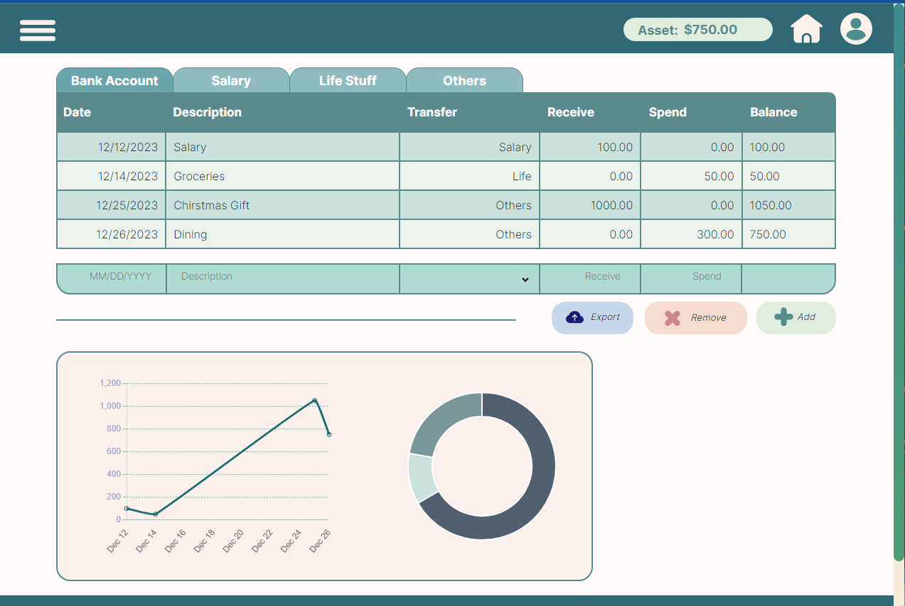

# About the Project: Fianance App
Grace and Yongyi's Website

<!-- ABOUT THE PROJECT -->
## About The Project

<!--Here's a blank template to get started: To avoid retyping too much info. Do a search and replace with your text editor for the following: `github_username`, `repo_name`, `twitter_handle`, `linkedin_username`, `email_client`, `email`, `project_title`, `project_description` -->

The Current Progress


The MockUp


Finance app with transactions and graphs

<p align="right">(<a href="#readme-top">back to top</a>)</p>

### Built With

* HTML
* CSS
* node.JS

<p align="right">(<a href="#readme-top">back to top</a>)</p>


<!-- GETTING STARTED -->
## Getting Started

How to be able to use it


### Installation

1. Clone the repo
   ```sh
   git clone https://github.com/YongyiZhou04/finance-app.git
   ```


<p align="right">(<a href="#readme-top">back to top</a>)</p>


<!-- USAGE EXAMPLES -->
## Usage

There is one current usage for this project, which is keeping track of your spendings and income. It also includes a summary of income/expenditures.

<!--_For more examples, please refer to the [Documentation](https://example.com)_-->

<p align="right">(<a href="#readme-top">back to top</a>)</p>


<!-- ROADMAP 
## Roadmap

- [ ] Feature 1
- [ ] Feature 2
- [ ] Feature 3
    - [ ] Nested Feature

See the [open issues](https://github.com/github_username/repo_name/issues) for a full list of proposed features (and known issues).

<p align="right">(<a href="#readme-top">back to top</a>)</p> -->


<!-- CONTRIBUTING -->
## Contributing

Contributions are great! Feel free to fork the repo or create a pull request if you have suggestions.

1. Fork the Project
2. Create your Feature Branch (`git checkout -b feature/AmazingFeature`)
3. Commit your Changes (`git commit -m 'Add some AmazingFeature'`)
4. Push to the Branch (`git push origin feature/AmazingFeature`)
5. Open a Pull Request

<p align="right">(<a href="#readme-top">back to top</a>)</p>


<!-- CONTACT -->
## Contact

Grace or Yongyi
<!-- [@twitter_handle](https://twitter.com/twitter_handle) - email@email_client.com) -->

<!-- Project Link: [https://github.com/github_username/repo_name](https://github.com/github_username/repo_name) -->

<p align="right">(<a href="#readme-top">back to top</a>)</p>


